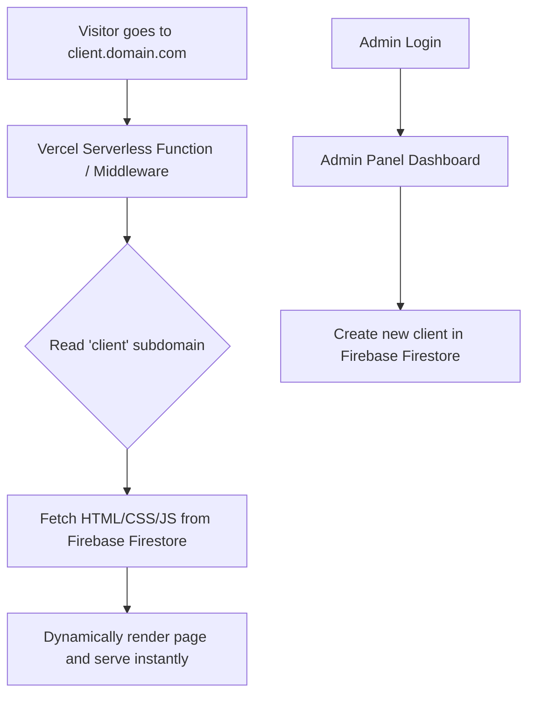

# Business Startup Plan: Dynamic Multi-Tenant Website Builder

This document outlines the business feasibility, technical architecture, and step-by-step implementation plan for a platform that allows creating and hosting simple websites for small shops at an affordable rate (e.g., ₹1,000/month).

---

## 1. Business Idea & Viability

### The Opportunity
* **Target Audience:** Small local businesses (grocery shops, salons, boutiques, local cafes, freelancers) who need a simple, professional web presence but find traditional developers too expensive.
* **Price Point:** ₹1,000/month (approximately $12/month) is extremely low friction. It provides high recurring revenue potential when scaled.
* **Value Proposition:** An instant website generated at `clientname.yourdomain.com` with zero build times, simple updates via an admin panel, and high performance.

---

## 2. Technical Architecture

Instead of deploying a separate codebase for each new client (which would be slow and hit Vercel's build limits), we will build a **dynamic multi-tenant router**. 

### The Stack
1. **Frontend & Router (Next.js)**: Hosted on Vercel and connected directly to a GitHub repository. Next.js handles the admin dashboard and intercepts subdomain requests.
2. **Database (Firebase Firestore)**: Stores website configuration metadata (business name, Google Drive image URLs, custom code strings, contact details, status, and domain mapping).
3. **Asset & Code Storage (Zero Cost)**: 
   * **Images (Google Drive Integration)**: Connect your Google Drive to the Admin Panel using a Google Cloud Service Account. The Admin Panel will automatically upload images, organize them in folders (e.g., `Client Websites/clientname/`), set permissions to public-view, and generate direct renderable image links.
   * **Source/Templates**: Managed entirely on GitHub (100% free repo hosting).
4. **Auth (Firebase Auth)**: Secures the admin panel so only you (the owner) can create and manage client sites.

---

## 3. Step-by-Step Implementation Plan

### Phase 1: Setup & Foundations
1. **Initialize Project:** Create a Next.js application in this workspace and push it to GitHub.
2. **Firebase Setup:** Create a Firebase project in the Google Cloud Console and obtain the config keys (Firestore database and Authentication only).
3. **Google Drive Setup:** Set up a Google Cloud Console project, enable Google Drive API, create a Service Account, and download the JSON key.
4. **Design System:** Configure vanilla CSS variables for a premium, sleek admin panel dashboard.

### Phase 2: Admin Dashboard & GDrive Uploads
1. **Authentication:** Simple, secure login page for you.
2. **Creation & Edit Forms:**
   * Business Name, Subdomain (e.g., `greenshop`), Contact Info.
   * **Image Upload Fields**: Drag-and-drop file inputs for Logo and Banners.
3. **GDrive API Integration (API Route `/api/upload`):**
   * Receives files uploaded from the dashboard.
   * Checks if a Google Drive folder for the client exists (e.g., `greenshop`). If not, creates it.
   * Uploads files to that specific folder, makes them publicly viewable, and returns the direct-download link (`https://drive.google.com/uc?export=download&id=FILE_ID`).
4. **Code Editor:** Integrated fields for raw **HTML**, **CSS**, and **JS** code.
5. **Database Operations:** Save, edit, update, toggle active/inactive status, or delete client sites directly.

### Phase 3: Edge Routing & Rendering (The Magic)
1. **Next.js Edge Middleware:**
   * Intercept incoming requests.
   * Extract the subdomain (e.g., if requesting `greenshop.yourdomain.com`, extract `greenshop`).
2. **Server-Side Render (SSR):**
   * Fetch the custom HTML/CSS/JS for `greenshop` from Firestore.
   * Return a fully formed page to the visitor in under 100ms.
3. **Local Dev Setup:** Configure `localhost` to simulate subdomains (e.g., `greenshop.localhost:3000`).

### Phase 4: No-Code Templates (For Non-Coders)
* To make it "with or without code", we will bundle 2-3 clean, premium templates (e.g., Service Directory, Restaurant Menu, Portfolio).
* If a template is chosen, the system automatically merges the client's business details (name, logo, menu items) into the template HTML and saves it.

---

## 4. Next Steps
To begin implementation:
1. Do you already have a **Firebase project** created, or should we set up the Next.js foundation first?
2. Do you have a custom domain (like `pkcreative.in` or similar) that we will use to configure wildcard domains on Vercel later?
